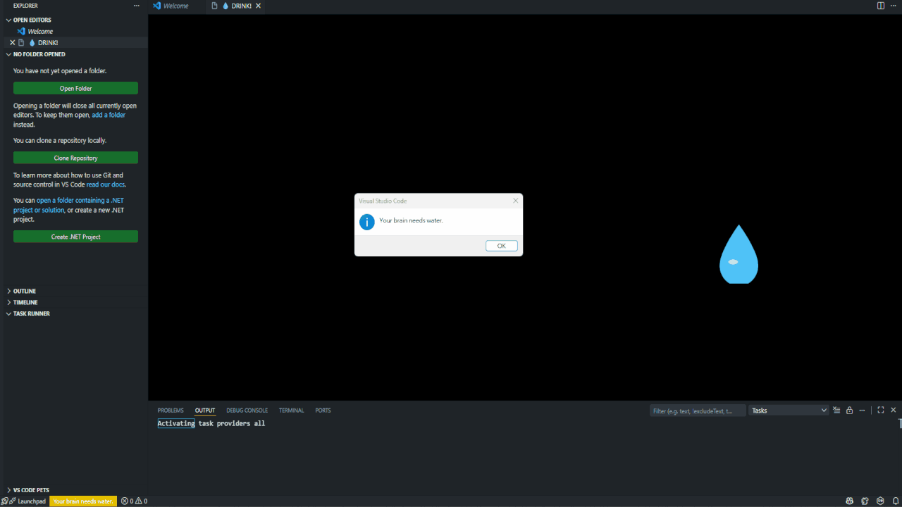
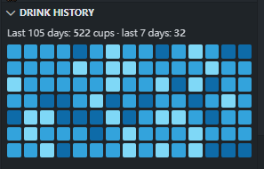

# Drink the water right nowww




# English

Stop coding, is time to drink water. That's the whole thing.

## Features

1. Status bar reminder
2. Full-screen blocker with a DVD-style bouncing 💧 (click it to count a cup)
3. Red theme flash when it's time to drink
4. Drink counter — status bar shows ml drunk / goal. Hover for a progress bar. Celebrates 1500/2000/4000ml. Resets every day
5. Countdown in the status bar (bottom right). Click it to pause/resume
6. Auto-freeze when you step away, resumes when you start typing
7. Drink history in the Explorer view — a GitHub-style contribution heatmap (15 weeks) of every cup
8. Blockers have a **Snooze** button

## Install

Dev setup: open the folder, press F5. It'll compile and pop an Extension Development Host.

Packaging:

```bash
npm install
npm run package
```

That gives you `drink-water-nag-0.0.1.vsix`. Install it via Extensions → … → Install from VSIX.

## Settings

Search `drink water` in Settings. Everything has a default, so you don't need to touch anything.

| Setting | Default | Notes |
| --- | --- | --- |
| `drinkWater.enabled` | `true` | Master switch |
| `drinkWater.intervalMinutes` | `30` | How often it nags you |
| `drinkWater.idlePauseMinutes` | `5` | Auto-pause after no typing for this long. `0` = off |
| `drinkWater.blocker` | `true` | Full-screen page that fills the editor and re-opens when closed. Confirm button unlocks after a delay |
| `drinkWater.redAlert` | `false` | Switch VS Code to the red theme when it's time to drink, restore after you confirm |
| `drinkWater.confirmDelaySeconds` | `3` | Blocker confirm button delay (0–30s). `0` = clickable immediately |
| `drinkWater.bounceLogo` | `true` | DVD screensaver panel. Also set to false if you hate it |
| `drinkWater.language` | `auto` | `auto`, `en`, `zh-tw`, `zh-cn` |
| `drinkWater.cupSizes` | `[150, 250, 350, 500]` | Available cup sizes for the drink picker, in ml |
| `drinkWater.fastDrinkMode` | `false` | Quickly record a drink using `mlPerCup` without prompting for cup size |
| `drinkWater.targetMl` | `2500` | Daily goal in ml directly |
| `drinkWater.mlPerCup` | `350` | ml added per recorded cup |
| `drinkWater.milestones` | `[1500, 2000, 4000]` | Celebration toasts at these daily totals (ml) |
| `drinkWater.snoozeMinutes` | `10` | How long the blocker's Snooze button postpones the reminder |
| `drinkWater.messages` | `[]` | Custom messages, cycled in order. Empty = built-in |

One thing to know: `drinkWater.messages` overrides the language setting. If you set custom messages, they're used as-is, whatever language they're in.

## Commands

- **Reset Drink Water Timer** — resets and records a cup (default size)
- **Record a Drink (Choose Size)** — opens a picker: 150/250/350/500ml or custom. Clicking the status bar does this too
- **Show Drink Water Reminder Now** — fires a reminder on demand. Handy for testing without waiting 30 minutes
- **Pause/Resume Drink Water Countdown** — same as clicking the countdown in the status bar
- **Reset Today's Drink Records** — clears today's history and counter
- **Reset All Drink Records** — clears the whole history and counter

## Development

```bash
npm install
npm run compile    # or just press F5
npm run package    # build the .vsix
```

The `out/` folder is build output, don't edit it. Change things in `src/` and recompile.

## License

MIT

---

## 中文說明

# 喝個水吧

別再寫程式了，該喝水了。就這麼簡單。

## 功能

1. 狀態列提醒
2. 全螢幕擋門 + DVD 風格彈跳的 💧（點它算一杯）
3. 到點時將 VS Code 切換成紅色主題
4. 飲水計量 — 狀態列顯示 `ml / 目標ml`。懸停顯示進度條。達到 1500 / 2000 / 4000ml 時會有提示。每天自動歸零
5. 狀態列（右下角）倒數計時。點它暫停／繼續
6. 離開電腦太久自動暫停，開始打字自動恢復
7. Explorer 裡的飲水記錄 — GitHub 風格的貢獻熱力圖（15 週）

## 安裝

開發模式：開啟資料夾，按 F5，會自動編譯並開一個「Extension Development Host」。

打包：

```bash
npm install
npm run package
```

會產生 `drink-water-nag-0.0.1.vsix`。用「延伸模組 → … → 從 VSIX 安裝」裝入即可。

## 設定

在設定中搜尋 `drink water`。所有設定都有預設值，通常不需要動。

| 設定 | 預設 | 說明 |
| --- | --- | --- |
| `drinkWater.enabled` | `true` | 總開關 |
| `drinkWater.intervalMinutes` | `30` | 多久提醒一次 |
| `drinkWater.idlePauseMinutes` | `5` | 停止輸入多久（分鐘）就自動暫停倒數。`0` = 關閉 |
| `drinkWater.blocker` | `true` | 全螢幕擋門：佔滿編輯區，關掉會立刻再彈出，必須點確認。確認按鈕需等待解鎖 |
| `drinkWater.redAlert` | `false` | 提醒時切換成紅色主題，確認飲水後還原 |
| `drinkWater.confirmDelaySeconds` | `3` | 擋門確認按鈕的延遲（0–30 秒）。`0` = 立刻可點 |
| `drinkWater.bounceLogo` | `true` | DVD 螢幕保護面板。討厭的話可以關掉 |
| `drinkWater.language` | `auto` | `auto`、`en`、`zh-tw`、`zh-cn` |
| `drinkWater.cupSizes` | `[150, 250, 350, 500]` | 飲水選單可選杯數，單位為 ml |
| `drinkWater.fastDrinkMode` | `false` | 快速記錄一杯，直接使用 `mlPerCup`，不再詢問杯量 |
| `drinkWater.targetMl` | `2500` | 每日目標 ml |
| `drinkWater.mlPerCup` | `350` | 每記錄一杯所加的毫升數 |
| `drinkWater.messages` | `[]` | 自訂提醒短句，依序輪播。留空 = 使用內建短句 |

注意：`drinkWater.messages` 會覆蓋語言設定。自訂短句會原封不動使用。

## 指令

- **重置飲水計時** — 重置並記錄一杯（等同點狀態列）
- **立即顯示飲水提醒** — 立刻觸發提醒。測試時不用等 30 分鐘
- **暫停／繼續飲水倒數** — 等同點狀態列的倒數計時
- **重設今日飲水記錄** — 清除今日的記錄與計量
- **重設全部飲水記錄** — 清除整個歷史與計量

## 開發

```bash
npm install
npm run compile    # 或直接按 F5
npm run package    # 打包 .vsix
```

`out/` 是建置輸出，不要直接編輯。改 `src/` 後重新編譯。

## 授權

MIT
